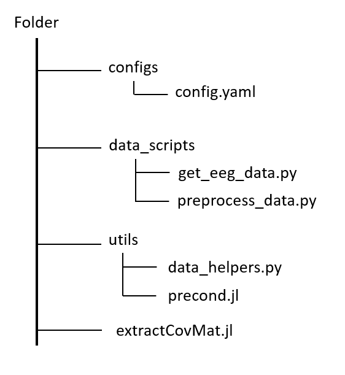

# PRÉ-TRAITEMENT DES DONNÉES

## Configuration du dossier

## Quelques commandes Julia

| Objectif | Commande Julia |
|-----------|---------------|
| Ouvrir un terminal Julia | `Alt + J + O` |
| Installer un package Julia | `Alt + ]` puis `add nomPackage` |
| Savoir dans quel répertoire on se trouve | `pwd()` |
| Changer de chemin | `cd("chemin")` |
| Lancer un fichier Julia | `include("nom.jl")` |

---

## Télécharger le corpus FII_BCI_Corpus

1. Ouvrir un terminal Julia.
2. Installer **Eegle.jl**.
3. Exécuter les commandes :

```julia
using Eegle
downloadDB()
```

---

## Extraire les matrices de covariance des bases souhaitées

1. Ouvrir le script Julia `extractCovMat.jl`.
2. Modifier les chemins :
   - `MIDir` : chemin des bases du corpus.
   - `outDir` : chemin de sortie pour écrire les matrices de covariance et les labels associés.
3. Modifier les paramètres souhaités :
   - Classes à utiliser.
   - Nombre minimum d'essais.
   - Bande de fréquence `bandPass`.
   - Seuil de rejet d'artefacts `upperLimit`.
4. Lancer le script.

### Résultat

Les fichiers suivants sont générés :

- `covmat.npy` : matrices de covariance.
- `labels.npy` : labels associés.

---

## Pré-traiter les données

1. Ouvrir le fichier `config.yaml`.
2. Modifier les variables de la section `data/eeg` :

| Variable | Description |
|-----------|------------|
| `data_dir` | Chemin du dossier contenant les matrices de covariance et les labels |
| `processed_root` | Chemin du dossier où enregistrer les bases pré-traitées |
| `db_prefix` | Préfixe de la base à pré-traiter |
| `precond_explVar` | Paramètre de réduction de dimension :<br>- `0` : réduction automatique pour les bases de plus de 64 électrodes<br>- `1` : aucune réduction de dimension<br>- une valeur entre `0` et `1` : ratio de variance à conserver |

3. Lancer le script de pré-traitement :

```bash
python -m data_scripts.preprocess_data --config configs/config.yaml
```

### Résultat

Les différents *folds* des données pré-traitées sont générés et enregistrés dans le dossier défini par `processed_root`.